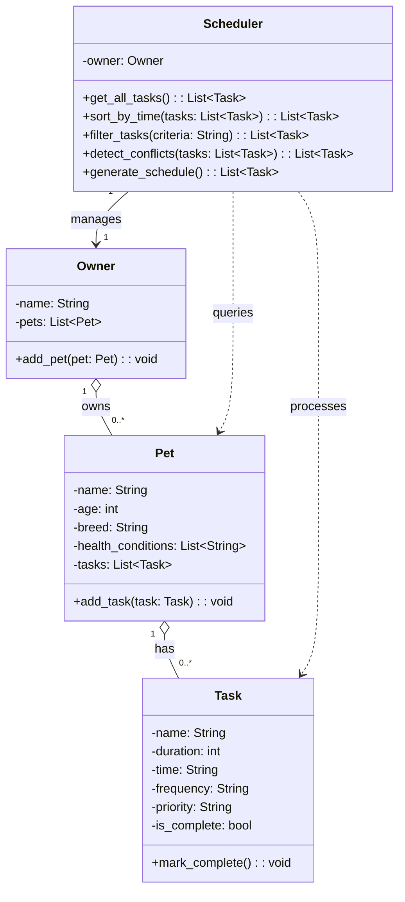

```mermaid
classDiagram
    class Owner {
        -name: String
        -pets: List~Pet~
        +add_pet(pet: Pet): void
    }

    class Pet {
        -name: String
        -age: int
        -breed: String
        -health_conditions: List~String~
        -tasks: List~Task~
        +add_task(task: Task): void
    }

    class Task {
        -name: String
        -duration: int
        -time: String
        -frequency: String
        -priority: String
        -is_complete: bool
        +mark_complete(): void
    }

    class Scheduler {
        -owner: Owner
        +get_all_tasks(): List~Task~
        +sort_by_time(tasks: List~Task~): List~Task~
        +filter_tasks(criteria: String): List~Task~
        +detect_conflicts(tasks: List~Task~): List~Task~
        +generate_schedule(): List~Task~
    }

    Owner "1" o-- "0..*" Pet : owns
    Pet "1" o-- "0..*" Task : has
    Scheduler "1" --> "1" Owner : manages
    Scheduler ..> Pet : queries
    Scheduler ..> Task : processes
```